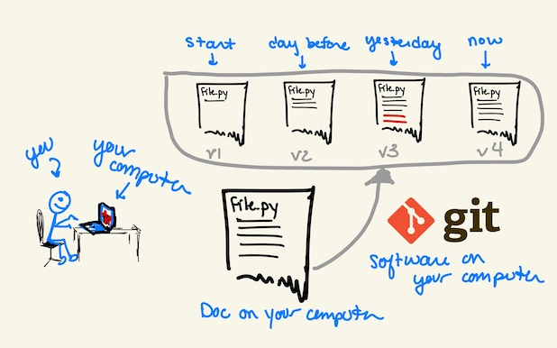
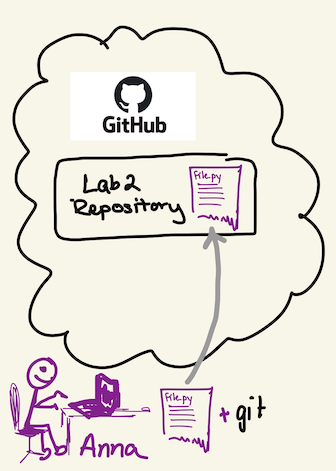
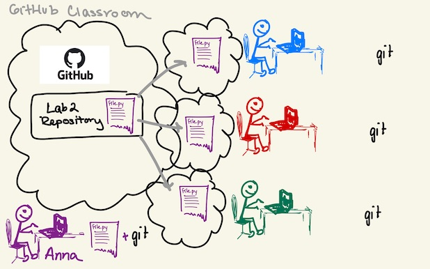
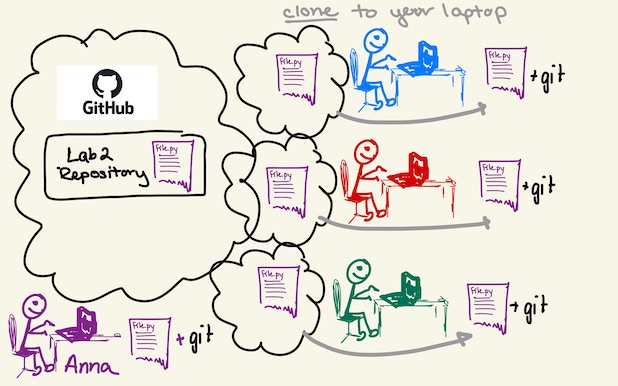
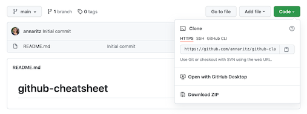
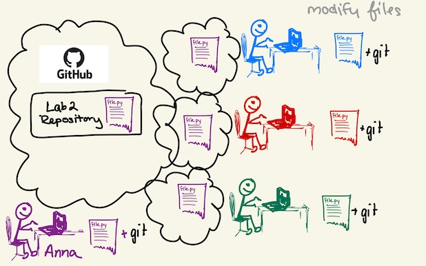
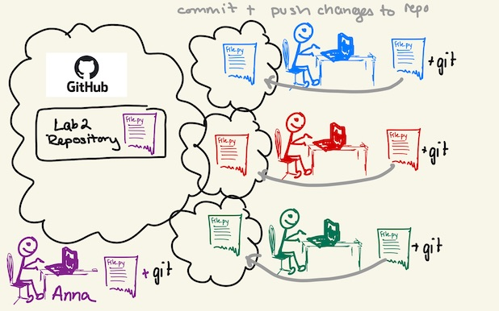
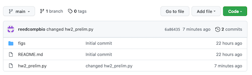
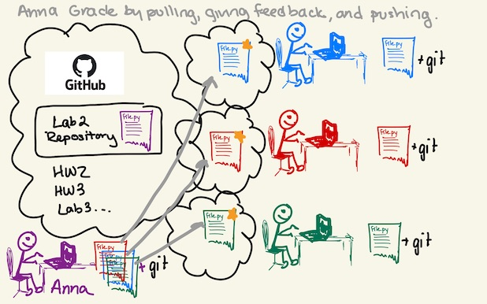

# GitHub Classroom CheatSheet

This is a summary of the commands you will use for managing files in git and GitHub.  See the "Getting Started" assignment for a high-level overview.  This assumes that you are using git in the terminal, in git bash, or in the Anaconda Powershell. If you are using some other means to communicate with GitHub (e.g. on GitHub Desktop or PyCharm), most of these concepts will be available in some form.

**Table of Contents**
- [Quick Start](#quick-start)
- [1 Navigating Directories](#1-navigating-directories)
- [2 Git](#2-git)
- [3 GitHub](#3-github)
- [4 Copy Assignment with GitHub Classroom](#4copy-assignment-with-github-classroom)
- [5 Get the Assignment on Your Laptop](#5-get-the-assignment-on-your-laptop)
- [6 Make Changes on Your Laptop](#6-make-changes-on-your-laptop)
- [7 Submit the Assignment by Committing using Git and Pushing to GitHub](#7-submit-the-assignment-by-committing-using-git-and-pushing-to-github)
- [8 Pulling Changes from GitHub to Your Laptop](#8-pulling-changes-from-github-to-your-laptop)
- [9 Merges and Conflicts](#8-merges-and-conflicts)

## Quick Start

This code block to a subdirectory and clones a repo.
```
cd Documents/bio331-assignments/
git clone https://github.com/CompSysBio-F21/graphspace-starter-reedcompbio.git
cd graphspace-starter-reedcompbio/
```

This code block adds and commits changes.
```
git add -u
git commit -m "commit message"
```

This code pulls changes (e.g., feedback or assignment fixes) from the GitHub repo to your local repo.
```
git pull
```

When you pull changes to your local machine, three things could happen:
1. **The code is updated.** This is great! You're done.
2. **A window opens to add a message.** This means that git is _merging_ the remote changes with your own committed code. You can simply quit the editor (try `:q` and hit enter if you are in `vim`).
3. **You get a conflict.** Agh! This means that git cannot merge the code, and you'll have to do it. Check out [Section 9 (Merges and Conflicts)](#8-merges-and-conflicts).

:exclamation: What happens if you open `vim` in the console and can't get out? Learn [10 different ways to exit vim](https://www.linuxfordevices.com/tutorials/linux/exit-vim-editor).

## 1 Navigating Directories

Before you clone an assignment, you want to move to the directory where you store all your assignments. Useful commands:

- `pwd`: print working (current) directory. (Where am I?)
- `ls`: list contents of the current directory.
- `cd DIRNAME`: change directories to `DIRNAME`

:bulb: When you are writing a file or directory name in the terminal, you can always hit TAB - if the prefix you have written matches only one file, it will autocomplete.

**Example:** Suppose I have made a directory called `bio331-assignments` in my `Documents` folder.  When I open the terminal, I start at my _home directory_ (for me, it is `/Users/aritz`).  I will first print the working directory and then change directories to where I want to clone my assignments (the `$` denote the terminal prompt and shouldn't be entered).

```
$ pwd
/Users/aritz
$ cd Documents/bio331-assignments/
$ pwd
/Users/aritz/Documents/bio331-assignments
```

## 2 Git

Git is _version control software_. You install it on your laptop and use it to keep track of changes of documents.  Many editors have version control - for example, Google Docs has a way for you to select older versions of a document, see the document's history, etc. Git is good for plain text files that you have on your computer.  The files associated with one project can be under version control together - this is called a _repository_.

You need to have git installed on your laptop. Most users will [install the software itself](https://git-scm.com/book/en/v2/Getting-Started-Installing-Git), though some tools like [GitHub Desktop](https://desktop.github.com/) install it as part of that tool.



Git can be used by you without any internet connection - it is useful for storing versions of **plain-text files** (like Python files, in this class).  Unlike Google Docs, you decide when you want to _commit_ a version of your files. You will see git commands later to do this.

## 3 GitHub

GitHub is a cloud-based hosting service for files under version control.  GitHub is quite useful if you work on a project with others, or you work with assignments in a class.  I have already made a project  on my laptop (let's call it Lab2), and using git I _pushed_ a copy of it to GitHub.  Now there is a version of Lab2 on my laptop and in the cloud.



## 4 Copy Assignment with GitHub Classroom

[GitHub Classroom](https://classroom.github.com/classrooms) offers a way for a class to work with assignments. In Bio331, you will get an **assignment link**. When you click an assignment link, you will generate a copy of the Lab2 repository in _your_ GitHub account (in the cloud). You can open the repo using the GitHub link to view the materials.



Note that all Lab2 repository copies are all the same - this makes sense because all students should start with the same set of instructions.

## 5 Get the Assignment on Your Laptop

Now you have the assignment in your GitHub account. However, you will want to modify these files on your own laptop.  This is called _cloning_ a repo.



You can clone the repo by clicking the `Code` button. You have three options:



1. _clone_ the repo using the `git clone <URL>` command in Terminal, where the `<URL>` can be copied from the website.
2. Open the code in GitHub Desktop.
3. Download a zipped folder.

Here, we will describe Option 1. In terminal (or GitBash or Anaconda Powershell), navigate to the directory on your laptop where you want to put these files.  Then copy the URL from the website and _clone_ the repo (again ignore the `$`):

```
$ git clone https://github.com/CompSysBio-F21/graphspace-starter-reedcompbio.git
Cloning into 'graphspace-starter-reedcompbio'...
remote: Enumerating objects: 8, done.
remote: Counting objects: 100% (8/8), done.
remote: Compressing objects: 100% (8/8), done.
remote: Total 8 (delta 0), reused 7 (delta 0), pack-reused 0
Unpacking objects: 100% (8/8), done.
```
:exclamation: You will need to enter your username and password.  You might get an error about needing a [GitHub Authentication Token](https://docs.github.com/en/github/authenticating-to-github/keeping-your-account-and-data-secure/creating-a-personal-access-token). This is a new security measure from GitHub which is essentially a more secure password.  Follow the steps to create a personal access token and use _that_ instead of your GitHub password.

You can then confirm that the repo has been cloned and change directories to that repo:

```
$ ls
graphspace-starter-reedcompbio
$ cd graphspace-starter-reedcompbio/
$ pwd
/Users/aritz/Documents/bio331-assignments/graphspace-starter-reedcompbio
```

## 6 Make Changes on Your Laptop

Change the code on your laptop as you would usually do!  Now, everyone's version of the code on their laptop is different.



## 7 Submit the Assignment by Committing using Git and Pushing to GitHub

You're ready to submit the assignment!  To do this, you first need to _commit_ the code in git (the version control on your laptop) and then _push_ that commit to GitHub.  Your changes will then be reflected in the cloud.

### Checking which files are modified (`git status`)

At any time, you can type `git status` in your directory.  This is one of the most useful commands git offers.  

```
$ git status
On branch main
Your branch is up to date with 'origin/main'.

Changes not staged for commit:
  (use "git add <file>..." to update what will be committed)
  (use "git restore <file>..." to discard changes in working directory)
	modified:   hw2_prelim.py
no changes added to commit (use "git add" and/or "git commit -a")
```

Here, `hw2_prelim.py` has been modified on my laptop but that change has _not_ been committed in git.

### Committing modified files

1. First, you must _add_ the files that you have modified and want to be committed:
```
$ git add hw2_prelim.py
$ git status
On branch main
Your branch is up to date with 'origin/main'.
Changes to be committed:
  (use "git restore --staged <file>..." to unstage)
	modified:   hw2_prelim.py
```

Now, this modified file is ready to be committed.

:question: Why do we need to add specific files?  In your repository, you might have some files that you don't want to have versions of (for example, python might generate `.pyc` files, or you might have output files). To add all

:bulb: You can use `git add -u` to add all tracked files that have been modified (update tracked files).

2. Next, you then _commit_ the files you have added. Include a short _commit message_ in the command line with the `-m` flag.  

```
$ git commit -m "changed hw2_prelim.py"
[main 6a86435] changed hw2_prelim.py
 1 file changed, 1 insertion(+)
```

:exclamation: If you don't specify a commit message with the `-m` flag, then git "helpfully" prompts you to enter a commit message by opening an editor.  The default editor is [vi](https://en.wikipedia.org/wiki/Vi) and is used _within the terminal!_  It is useful to learn a few simple commands in vi, but if this happens just google "how to quit vi" exit the environment.

:bulb: You can commit your code multiple times as you work on assignments! This is preferred, actually - I typically commit my code at least once a day (at the end of the day when I'm done working).

At this point, `git status` tells us that there are no unmodified files, _but_ now our local version is different from the repo on GitHub.

```
$ git status
On branch main
Your branch is ahead of 'origin/main' by 1 commit.
  (use "git push" to publish your local commits)

nothing to commit, working tree clean
```

### Pushing the commits to your repo in GitHub



Finally, you need to _push_ the commits to GitHub.  

```
$ git push
Enumerating objects: 5, done.
Counting objects: 100% (5/5), done.
Delta compression using up to 8 threads
Compressing objects: 100% (3/3), done.
Writing objects: 100% (3/3), 281 bytes | 281.00 KiB/s, done.
Total 3 (delta 2), reused 0 (delta 0)
remote: Resolving deltas: 100% (2/2), completed with 2 local objects.
To https://github.com/CompSysBio-F21/graphspace-starter-reedcompbio.git
   f473bba..6a86435  main -> main
```

At this point, you can go to GitHub and confirm that the repo contains your changes and your commit messages.

:bulb: You might also see this command as `git push origin head`, which specifies that you are pushing your `main` branch to the `main` branch in GitHub.  There is a whole world of git branching and forking that we do not cover here.



## 8 Pulling Changes from GitHub to Your Laptop

Now, Anna will pull your code to her laptop, run it and provide feedback, and commit/push the feedback to your GitHub repo.



You can view these changes on GitHub. If you want to get those changes onto your laptop, use `git pull`:

```
$ git pull
remote: Enumerating objects: 4, done.
remote: Counting objects: 100% (4/4), done.
remote: Compressing objects: 100% (2/2), done.
remote: Total 3 (delta 0), reused 0 (delta 0), pack-reused 0
Unpacking objects: 100% (3/3), done.
From https://github.com/CompSysBio-F21/graphspace-starter-reedcompbio
   6a86435..3f8629d  main       -> origin/main
Updating 6a86435..3f8629d
Fast-forward
 feedback.txt | 1 +
 1 file changed, 1 insertion(+)
 create mode 100644 feedback.txt
```

Now, there is now a new file called `feedback.txt`.

:bulb: If there are changes to the assignment, Anna might also push changes to your repo. You can pull these changes using `git pull` as well.

## 9 Merges and Conflicts

There is a chance that, when writing code as a group (or when Anna pushes changes), the repository on GitHub will have changes that you do not have on your laptop yet.  Further, _you_ might be making changes on your local version that haven't been committed. When you type `git pull`, git will attempt to _merge_ the two versions.

### Merging

:bulb: Git is actually pretty smart, and will know when your changes are in a different location than the changes in the cloud. For example, suppose you are working on the assignment `python` file and Anna uploads `feedback.txt` - those are changes in two different files.

Before git merges your code, it will prompt you to enter a message. It will usually open `vim` in the console (or NotePad on a Window's machine). You can enter a message or just quit the editor for git to continue working. To exit `vim`, type `:q` and hit Enter.

:question: What happens if I have changes that I have _not_ yet committed?  Git won't even try to merge, and will warn you that you have un-committed changes.  You must `add` and `commit` your changes before git will merge.

### Resolving Conflicts

Now, suppose instead that you are working on a `main()` function in `run.py` and Anna makes changes to the same `main()` function. Git won't know which version should be kept, or how the lines in this function should be resolved.  When this happens, git will say that you have a `merge conflict` in `run.py`.  

When you open `run.py`, you will see **your** changes bracketed between `<<<<<<` and `======` and changes from the **GitHub Repo** bracketed by `======` and `>>>>>>>`:
```
<<<<<<< HEAD
this is YOUR code
=======
this is THEIR code
>>>>>>> <commit version>
```

Delete the tags with `<`,`=`, and `>`, and manually merge your code and GitHub's code. It's possible that you want to keep both versions of the code (for example if two functions were written in the same place in `run.py`, but they are different functions). In other cases, you want to remove duplicate code.

Once you have made these changes, verify that you can run the code and then `add` and `commit` it.  Congrats, you have resolved the merge!

For more information, see [Resolve Merge Conflits in Git](https://docs.github.com/en/github/collaborating-with-pull-requests/addressing-merge-conflicts/resolving-a-merge-conflict-using-the-command-line).  Here's another, more in-depth tutorial about [Git merge conflicts](https://www.atlassian.com/git/tutorials/using-branches/merge-conflicts).
